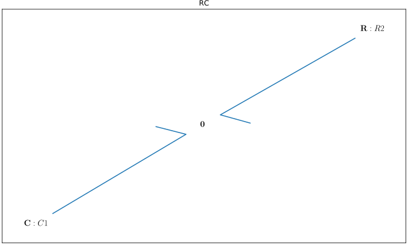
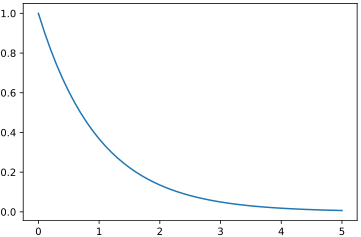
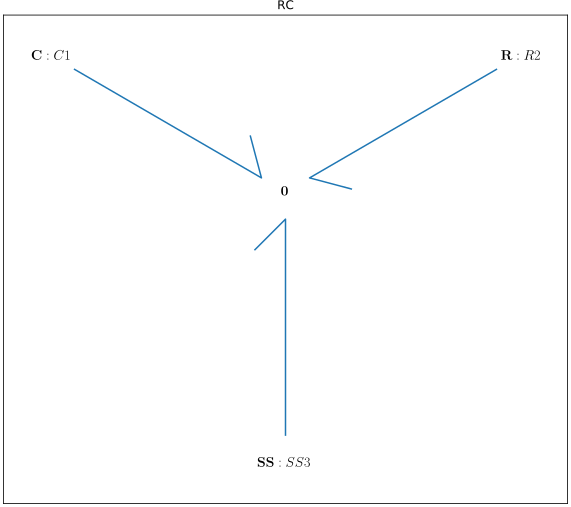
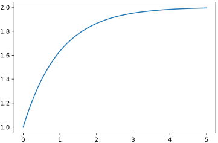
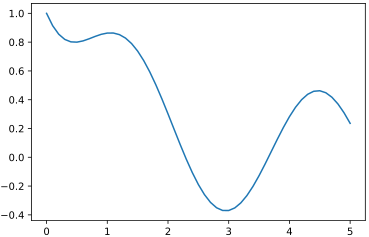
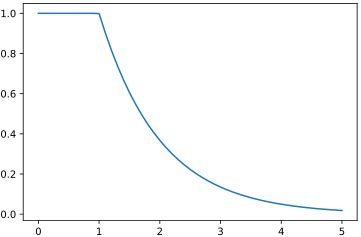
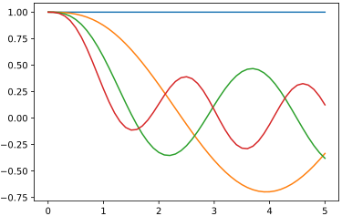

Tutorial: Driven Filter Circuit
===============================
+----------------+------------------------------------------------------------+
| Goal:          | Build and simulate a simple passive filter using basic     |
|                | bond graph modelling techniques.                           |
+----------------+------------------------------------------------------------+
| Difficulty:    | Beginner.                                                  |
+----------------+------------------------------------------------------------+
| Requirement:   | ``BondGraphTools``, Jupyter.                               |
+----------------+------------------------------------------------------------+
| How to follow: | Enter each block of code in consecutive cells in a Jupyter |
|                | notebook.                                                  |
+----------------+------------------------------------------------------------+

In part 1 of this tutorial we will demonstrate how to build and connect models
using ``BondGraphTools`` by constructing a simple passive filter.
Part 2 introduces control sources, and provides examples of how one can perform
parameter sweeps or input comparisons.

Part 1: Basic Use
-----------------

First, import ``BondGraphTools`` and create a new model with the name "RC"::

    import BondGraphTools as bgt
    model = bgt.new(name="RC")

Now create a new generalised linear resistor ('R' component), a generalised
linear capacitor ("C" component) with resistance and capacitance both set to 1,
and an equal effort ("0" junction) conservation law through which these
components share energy.::

    C = bgt.new("C", value=1)
    R = bgt.new("R", value=1)
    zero_law = bgt.new("0")

Add the newly created components to the model::

    bgt.add(model, R, C, zero_law)

Once the components are added to the model, connect the components and the law
together. (Note the first argument is the tail of the energy bond, the second
is the head)::

    bgt.connect(R, zero_law)
    bgt.connect(zero_law, C)

Draw the model to make sure everything is wired up::

    bgt.draw(model)

which produces a sketch of the network topology.

To demonstrate that the isolated system is behaving correctly, we simulate
from the initial where the C component has :math:`x_0=1` and run the simulation over
the  time interval :math:`(0,5)`. This results in a vector :math:`t` of time points
and a corresponding vector :math:`x` of data points which can then be plotted against
each other with ``matplotlib``::

    timespan = [0, 5]
    x0 = [1]
    t, x = bgt.simulate(model, timespan=timespan, x0=x0)
    from matplotlib.pyplot import plot
    fig = plot(t,x)

Part 2: Control
---------------
We wish to see how this filter responds to input.
Add flow source by creating a new Sf component, adding to the model, and
connecting it to the common voltage law::

    Sf = bgt.new('Sf')
    bgt.add(model, Sf)
    bgt.connect(Sf, zero_law)

The model should now look something like this::

    bgt.draw(model)

The model also now has associated with it a control variable ``u_0``.
Control variables can be listed via the attribute ``model.control_vars`` and we
can observe the constitutive relations, which give the implicit equations of
motion for the system in sympy form::

    model.constitutive_relations
    # returns [dx_0 - u_0 + x_0]

where ``x_0`` and ``dx_0`` are the state variable and it's derivative. One can
identify where that state variable came from via::

    model.state_vars
    # returns {'x_0': (C: C1, 'q_0)}

Here ``C: C1`` is a reference to the ``C`` object itself.

Part 3: Simulations
-------------------
We will now run various simulations.

Firstly, we simulate with constant effort by passing the control law :math:`u_0=2`
to the solver and plotting the results::

    timespan = [0, 5]
    x0 = [1]
    t, x = bgt.simulate(model, timespan=timespan, x0=x0, control_vars={'u_0':2})
    plot(t,x)

Time dependent control laws can be specified as string. In this case we
consider the response to a :math:`\pi^{-1}` Hz sine wave::

    t, x = bgt.simulate(model, timespan=timespan, x0=x0, control_vars={'u_0':'sin(2*t)'})
    plot(t,x)

One can also consider the impulse response of by applying a step function
input ot the control law, here $x$ and $dx$ refer to the state-space of the model::

    def step_fn(t,x,dx):
        return 1 if t < 1 else 0

    t, x = bgt.simulate(model, timespan=timespan, x0=x0, control_vars={'u_0':step_fn})
    plot(t,x)

Finally we run a sequence of simulations where a new control law is generated
based on the loop iteration::

    fig = plt.figure()
    for i in range(4):
        func_text = "cos({i}*t)".format(i=i)
        t_i, x_i = bgt.simulate(model, timespan=timespan, x0=x0, control_vars={'u_0':func_text})
        plot(t_i,x_i)

