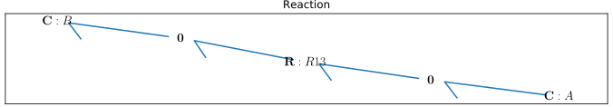
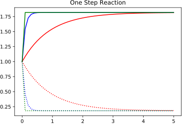
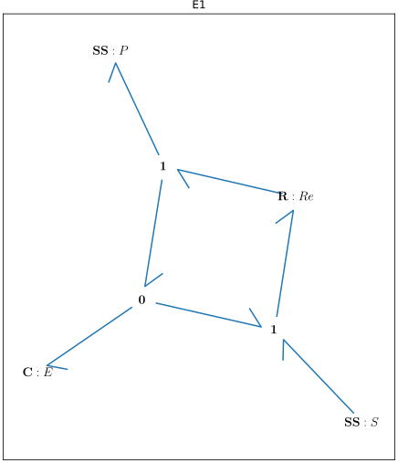
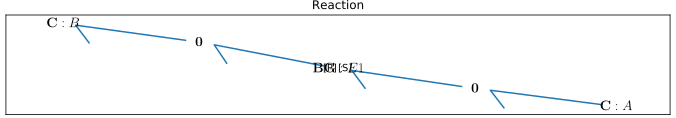
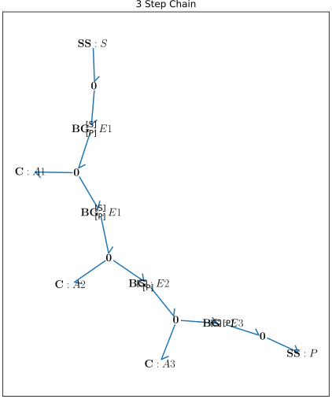

Tutorial: Building Modular Enzymatic Reactions
==============================================
Overview
--------
Goal: To build and simulate a simple reaction A = B, and exploit modularity to
substitute in different reactions structures.

Difficulty: Intermediate

Requirement: BondGraphTools, jupyter.

How to follow: Enter each block of code in consecutive cells in a jupyter
notebook.

Part 1: Building a basic chemical reaction
------------------------------------------

Begin by opening a new jupyter notebook, importing the toolkit and
creating a new model::

    import BondGraphTools as bgt
    model = bgt.new(name="Reaction")

Next, add two chemical species, two common effort junctions and a reaction::

    A_store = bgt.new("Ce", name="A", library="BioChem", value={'k':10})
    B_store= bgt.new("Ce", name="B", library="BioChem", value={'k':1})
    A_junction = bgt.new("0")
    B_junction = bgt.new("0")
    reaction = bgt.new("Re", library="BioChem")

    bgt.add(model, A_store, B_store,A_junction, B_junction, reaction)

Then wire the network up::

    bgt.connect(A_store, A_junction)
    bgt.connect(A_junction, reaction)
    bgt.connect(reaction, B_junction)
    bgt.connect(B_junction, B_store)

Set the pressure and temperature to one (ie; parameters are normalised)
and set the conductance of the reaction component to `None` so as to treat it as
control variable.::

    for param_index, (component, parameter_name) in model.params.items():
        if parameter_name in ("T", "R"):
            bgt.set_param(model, param_index, 1)
        elif component is reaction:
            bgt.set_param(model, param_index, None)

Draw the model to inspect the network topology.::

    bgt.draw(model)

One can go ahead and run simulations on this for example, by varying the
reaction rate inside a loop and plotting the results::

    import matplotlib.pyplot as plt
    x0 = {"x_0":1, "x_1":1}
    t_span = [0,5]
    fig = plt.figure()
    ax = plt.gca()
    ax.set_title("One Step Reaction")

    for c, kappa in [('r', 0.1), ('b', 1), ('g', 10)]:
        t, x = bgt.simulate(model, x0=x0, timespan=t_span, control_vars={"u_0":kappa})
        plt.plot(t,x[:,0], c+':')
        plt.plot(t,x[:,1], c)

Part 2: Modularity and enzyme catalysed reactions.
--------------------------------------------------

We wish the replace the one step reaction above with an enzyme catalysed
reaction. Our first step will be to make a factory function which takes an
enzyme name as an argument and produces an enzyme catalysed reaction model.
This process is nearly identical to the steps followed in part 1, however we
now wrap the procedure in a function so we can reuse it later.
Define a factory function to produce models of enzyme catalysed reactions:::

    def enzyme_catalysed_reaction(name):
        """
        This function produces a bond graph model of an basic enzyme catalysed
        reaction of the from `S + E  = E + P` where the substrate and product
        are exposed as external ports.

        Args:
            name (str): The name of the enzyme

        Returns:
            `BondGraph`: The resulting model
        """

        cat_model = bgt.new(name=name)

        # Construct the external ports.
        substrate = bgt.new("SS", name="S")
        product = bgt.new("SS", name="P")

        # Here we build the reaction, again with the rate as a control variable.
        # Again, we assume parameterised have be normalised with respect to
        # pressure and temperature.
        cat_reaction = bgt.new("Re", name="Re", library="BioChem", value={'r':None 'R':1, 'T':1})

        # We choose 'k' to be 1 for demonstration.
        enzyme = bgt.new("Ce", name="E", library="BioChem", value={'k':1, 'R':1, 'T':1})

        # Substrate + Enzyme flux conservation law
        SE = bgt.new('1')
        # Product + Enzyme flux conservation law
        PE = bgt.new('1')

        # Conservation of enzyme law.
        law_E = bgt.new("0")

        bgt.add(cat_model, substrate, product, enzyme, SE, PE, law_E, cat_reaction)

        connections = [
            (substrate, SE),
            (law_E, SE),
            (law_E, enzyme),
            (SE, cat_reaction),
            (cat_reaction, PE),
            (PE, law_E),
            (PE, product)
        ]
        for tail, head in connections:
            bgt.connect(tail, head)

        bgt.expose(substrate, 'S')
        bgt.expose(product, 'P')

        return cat_model

Use this function to build a new enzyme catalysed reactions, and draw it to make
sure the topology is correct::

    E1 = enzyme_catalysed_reaction("E1")
    bgt.draw(E1)

In order to replace the reaction, with the newly built `E1`, first remove all
the bonds connecting the original reaction.::

    for bond in model.bonds:
        if reaction is bond.head.component or reaction is bond.tail.component:
            bgt.disconnect(bond.tail, bond.head)

Then remove the old reaction and add `E1`::

    bgt.remove(model, reaction)
    bgt.add(model, E1)

Complete the substitution by connecting the substrate to 'A' and the product to
'B'. Draw the model to vefify the substitution is complete ::

    substrate_port, = (port for port in E1.ports if port.name == "S")
    product_port, = (port for port in E1.ports if port.name == "P")

    bgt.connect(A_junction, substrate_port)
    bgt.connect(product_port, B_junction)

    bgt.draw(model)

Inspect the models constitutive relations, state variables and control vars by::

    # State Variables
    print(model.state_vars)
    # outputs {'x_0': (C: A, 'q_0'), 'x_1': (C: B, 'q_0'), 'x_2': (BG: E1, 'x_0')}

    # Control Variables
    print(model.control_vars)
    # outputs {'u_0': (BG: E1, 'u_0')}

    print(model.constitutive_relations)
    # outputs [dx_0 + 10*u_0*x_0*x_2 - u_0*x_1*x_2,
    #          dx_1 - 10*u_0*x_0*x_2 + u_0*x_1*x_2,
    #          dx_2]

Here we can see that the `x_2` co-ordinate of the model points to the
`x_0` co-ordinate of the enzyme reaction, which we know to be the state of the
enzyme component `C:E`. Observe that the appearance of `dx_2` alone in the
constitutive relations implies that `x_2`, the enzyme quantity, is conserved.

Part 3: Exploiting Modularity to reaction chains
------------------------------------------------
We will now use the above function to build a reaction chain.
That is, we think the correct model of `A=B` is `A = A1 = A2 = A3 = B`.
Create a new model to represent the reaction chain and add the substrate and
product ports::

    chain = bgt.new(name="3 Step Chain")
    substrate = bgt.new("SS", name='S')
    product = bgt.new("SS", name="P")
    substrate_law = bgt.new("0")
    product_law = bgt.new("0")
    bgt.add(chain, substrate, product, substrate_law, product_law)

    bgt.connect(substrate, substrate_law)
    bgt.connect(product_law, product)

    bgt.expose(substrate)
    bgt.expose(product)

Now, add the first step in the linear chain of reactions, and connect it to
the substrate law.::

    reaction_step = enzyme_catalysed_reaction('E1')

    bgt.add(reaction_step)
    substrate_port, = (port for port in reaction_step.ports if port.name == "S")
    bgt.connect(substrate_law, substrate_port)

Iteratively add each segment of the linear chain, by finding the product of the
last reaction, connecting that to a newly created intermediary :math:`A_i`,
which is then connected to the substrate of the next catalysed reaction.::

    for i in range(1, 4):
        last_product_port, = (port for port in reaction_step.ports if port.name == "P")
        step_law = bgt.new("0")
        step_ce = bgt.new("Ce", library="BioChem", name=f"A{i}", value={"R":R,"T":T, "k":1})
        reaction_step = enzyme_catalysed_reaction(f"E{i}")

        bgt.add(chain, step_ce, step_law, reaction_step)
        substrate_port, = (port for port in reaction_step.ports if port.name == "S")
        bgt.connect(last_product_port, step_law)
        bgt.connect(step_law, step_ce)
        bgt.connect(step_law, substrate_port)

    last_product_port, = (port for port in reaction_step.ports if port.name == "P")
    bgt.connect(last_product_port, product_law)

Draw the chain to make sure everything is connected.::

    bgt.draw(chain)

Observe that the constitutive relations::

     print(chain.constitutive_relations)

for this chain component is clearly a function of two efforts, and two flows,
in addition to the internal state variables, and control variables.

We can now return to our model, and swap out the `E1` for the 3 step chain::

    for bond in model.bonds:
        if E1 is bond.head.component or E1 is bond.tail.component:
            bgt.disconnect(bond.tail, bond.head)

    bgt.remove(model, E1)
    bgt.add(model, chain)

    substrate_port, = (port for port in chain.ports if port.name == "S")
    product_port, = (port for port in chain.ports if port.name == "P")

    bgt.connect(A_junction, substrate_port)
    bgt.connect(product_port, B_junction)

Observing `bgt.draw(model)`, the network topology of the model has not changed.
The difference is noticeable when the constitutive relations are produced.::

    print(model.constitutive_relations)
    # [dx_0 + 10*u_0*x_0*x_2 - u_0*x_2*x_3,
    #  dx_1 + u_3*x_1*x_8 - u_3*x_7*x_8,
    #  dx_2,
    #  dx_3 - 10*u_0*x_0*x_2 + u_0*x_2*x_3 + u_1*x_3*x_4 - u_1*x_4*x_5,
    #  dx_4,
    #  dx_5 - u_1*x_3*x_4 + u_1*x_4*x_5 + u_2*x_5*x_6 - u_2*x_6*x_7,
    # dx_6,
    # dx_7 - u_2*x_5*x_6 + u_2*x_6*x_7 - u_3*x_1*x_8 + u_3*x_7*x_8,
    # dx_8]

Where the model co-ordinates are given by::

    print(model.state_vars)
    # {'x_0': (C: A, 'q_0'),
    #  'x_1': (C: B, 'q_0'),
    #  'x_2': (BG: 3 Step Chain, 'x_0'),
    #  'x_3': (BG: 3 Step Chain, 'x_1'),
    #  'x_4': (BG: 3 Step Chain, 'x_2'),
    #  'x_5': (BG: 3 Step Chain, 'x_3'),
    #  'x_6': (BG: 3 Step Chain, 'x_4'),
    #  'x_7': (BG: 3 Step Chain, 'x_5'),
    #  'x_8': (BG: 3 Step Chain, 'x_6')}